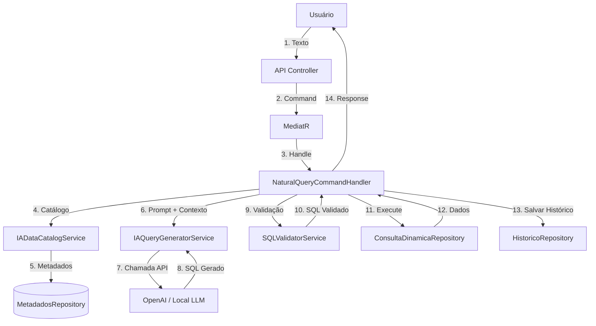

# 🤖 Plano de Implementação - Integração com IA

> **Objetivo:** Permitir consultas ao banco de dados Oracle usando linguagem natural
> **Padrão:** Clean Architecture + CQRS + MediatR + DDD
> **Data:** 22 de Novembro de 2025
> **Status:** 📋 Planejamento

---

## 📋 Índice

1. [Visão Geral](#visão-geral)
2. [Arquitetura Proposta](#arquitetura-proposta)
3. [Fluxo de Funcionamento](#fluxo-de-funcionamento)
4. [Estrutura de Código](#estrutura-de-código)
5. [Implementação Passo a Passo](#implementação-passo-a-passo)
6. [Segurança e Validações](#segurança-e-validações)
7. [Testes](#testes)
8. [Próximos Passos](#próximos-passos)

---

## 🎯 Visão Geral

### Objetivo

Permitir que usuários consultem o banco de dados usando **linguagem natural** ao invés de escrever SQL manualmente.

**Exemplo:**
```
Usuário: "Mostre os pedidos do cliente João dos últimos 30 dias"
IA: Analisa → Gera SQL → API executa → Retorna resultados
```

### Benefícios

- ✅ **Democratização de dados:** Não técnicos podem consultar o banco
- ✅ **Produtividade:** Consultas mais rápidas sem escrever SQL
- ✅ **Exploração de dados:** Facilita descoberta de insights
- ✅ **Integração com chatbots:** Pode ser exposto via assistente virtual

### Escopo da Fase 1

**Funcionalidades Core:**
- ✅ Conversão de texto para SQL (via IA)
- ✅ Validação de SQL gerado
- ✅ Execução segura de queries
- ✅ Histórico de consultas
- ✅ Feedback de usuário

**Fora do Escopo (Fase 2):**
- ❌ Interface de chat interativa
- ❌ Conversas multi-turn (contexto de conversa)
- ❌ Sugestões automáticas
- ❌ Treinamento de modelo customizado

---

## 🏗️ Arquitetura Proposta

### Diagrama de Componentes



### Camadas e Responsabilidades

#### **1. API Layer (Controllers)**
- `NaturalQueryController` - Recebe texto em linguagem natural
- Usa MediatR (padrão CQRS)
- Retorna resultados + SQL gerado

#### **2. Application Layer (Commands/Queries)**
- `NaturalQueryCommand` - Command com texto do usuário
- `NaturalQueryCommandHandler` - Orquestra todo o fluxo
- `ObterHistoricoQuery` - Consulta histórico de queries

#### **3. Domain Layer (Services)**
- `IADataCatalogService` - Gera contexto sobre o BD para a IA
- `IAQueryGeneratorService` - Integração com OpenAI/LLM
- `SQLValidatorService` - Valida SQL gerado pela IA
- `HistoricoConsultasDomainService` - Lógica de negócio do histórico

#### **4. Domain Layer (Entities)**
- `HistoricoConsulta` - Entity para armazenar histórico
- `ContextoCatalogo` - Value Object com metadados para IA

#### **5. Infrastructure Layer (Repositories)**
- `HistoricoConsultasRepository` - Persistência do histórico
- Usa `IUnitOfWork` para transações

---

## 🔄 Fluxo de Funcionamento

### Fluxo Completo (Passo a Passo)

```
1. Usuário envia: "Mostre os pedidos do cliente João dos últimos 30 dias"
   ↓
2. NaturalQueryController recebe POST /api/consulta/natural
   ↓
3. Cria NaturalQueryCommand e envia via MediatR
   ↓
4. NaturalQueryCommandHandler recebe o command
   ↓
5. IADataCatalogService gera contexto:
   - Lista de tabelas disponíveis
   - Campos de cada tabela
   - Relacionamentos entre tabelas
   - Exemplos de queries
   ↓
6. IAQueryGeneratorService:
   - Monta prompt com contexto + pergunta do usuário
   - Chama OpenAI API (gpt-4 ou gpt-3.5-turbo)
   - Extrai SQL da resposta
   ↓
7. SQLValidatorService valida SQL:
   - Whitelist de tabelas
   - Sem comandos perigosos (DELETE, DROP, UPDATE)
   - Sintaxe válida para Oracle
   ↓
8. ConsultaDinamicaRepository executa SQL validado
   ↓
9. HistoricoRepository salva:
   - Pergunta original
   - SQL gerado
   - Sucesso/Erro
   - Timestamp
   ↓
10. Retorna para o usuário:
    - SQL gerado
    - Resultados da query
    - Metadata (tempo, linhas, etc.)
```

### Exemplo de Request/Response

**Request:**
```http
POST /api/consulta/natural
Content-Type: application/json

{
  "pergunta": "Mostre os pedidos do cliente João dos últimos 30 dias",
  "salvarHistorico": true
}
```

**Response:**
```json
{
  "perguntaOriginal": "Mostre os pedidos do cliente João dos últimos 30 dias",
  "sqlGerado": "SELECT p.* FROM PEDIDOS p JOIN CLIENTES c ON p.ID_CLIENTE = c.ID WHERE UPPER(c.NOME) LIKE '%JOÃO%' AND p.DATA_PEDIDO >= SYSDATE - 30",
  "totalLinhas": 5,
  "tempoExecucao": "0.234s",
  "dados": [
    { "ID": 1, "DATA_PEDIDO": "2025-11-15", "VALOR": 250.00, ... },
    { "ID": 3, "DATA_PEDIDO": "2025-11-20", "VALOR": 180.00, ... }
  ],
  "metadadosResposta": {
    "modeloIA": "gpt-4",
    "confianca": 0.95,
    "tokens": 450
  }
}
```

---

## 📁 Estrutura de Código

### Novos Arquivos a Criar

```
QueryBuilder.Domain/
├── Commands/
│   └── NaturalQuery/
│       ├── NaturalQueryCommand.cs              ⭐ NOVO
│       └── NaturalQueryResult.cs               ⭐ NOVO
│
├── Commands/Handlers/
│   └── NaturalQueryCommandHandler.cs           ⭐ NOVO
│
├── Entities/
│   └── HistoricoConsulta.cs                    ⭐ NOVO
│
├── ValueObjects/
│   ├── ContextoCatalogo.cs                     ⭐ NOVO
│   └── MetadadosResposta.cs                    ⭐ NOVO
│
├── Services/
│   ├── IAQueryGeneratorService.cs              ⭐ NOVO
│   └── SQLValidatorService.cs                  ⭐ NOVO
│
├── DomainServices/
│   ├── IADataCatalogService.cs                 ⭐ NOVO
│   └── HistoricoConsultasDomainService.cs      ⭐ NOVO
│
├── Validators/
│   └── NaturalQueryCommandValidator.cs         ⭐ NOVO
│
└── Interfaces/
    ├── IIAQueryGeneratorService.cs
    ├── ISQLValidatorService.cs
    └── Repositories/
        └── IHistoricoConsultasRepository.cs    ⭐ NOVO

QueryBuilder.Infra.Data/
└── Repositories/
    └── HistoricoConsultasRepository.cs         ⭐ NOVO

QueryBuilder.Infra.Externals/
├── OpenAI/
│   ├── OpenAIService.cs                        ⭐ NOVO
│   ├── OpenAISettings.cs                       ⭐ NOVO
│   └── Models/
│       ├── OpenAIRequest.cs                    ⭐ NOVO
│       └── OpenAIResponse.cs                   ⭐ NOVO
│
└── PromptTemplates/
    └── sql-generation-prompt.txt               ⭐ NOVO

QueryBuilder.Api/
└── Controllers/
    └── NaturalQueryController.cs               ⭐ NOVO

QueryBuilder.Tests/
└── Commands/Handlers/
    └── NaturalQueryCommandHandlerTests.cs      ⭐ NOVO

scripts/sql/
└── create-table-historico-consultas.sql       ⭐ NOVO
```

**Total:** ~20 arquivos novos

---

## 🔨 Implementação Passo a Passo

### **Fase 1: Infraestrutura Básica (Dia 1-2)**

#### 1.1 Criar Tabela de Histórico

**Arquivo:** `scripts/sql/create-table-historico-consultas.sql`

```sql
-- Tabela para armazenar histórico de consultas em linguagem natural
CREATE TABLE HISTORICO_CONSULTAS (
    ID NUMBER GENERATED ALWAYS AS IDENTITY PRIMARY KEY,
    PERGUNTA_ORIGINAL VARCHAR2(1000) NOT NULL,
    SQL_GERADO CLOB NOT NULL,
    SUCESSO NUMBER(1) DEFAULT 1 NOT NULL,
    ERRO VARCHAR2(500),
    TOTAL_LINHAS NUMBER,
    TEMPO_EXECUCAO_MS NUMBER,
    MODELO_IA VARCHAR2(50),
    TOKENS_USADOS NUMBER,
    DATA_CRIACAO TIMESTAMP DEFAULT SYSTIMESTAMP NOT NULL,
    USUARIO VARCHAR2(100),

    CONSTRAINT CHK_HISTORICO_SUCESSO CHECK (SUCESSO IN (0, 1))
);

-- Índices para performance
CREATE INDEX IDX_HISTORICO_DATA ON HISTORICO_CONSULTAS(DATA_CRIACAO DESC);
CREATE INDEX IDX_HISTORICO_USUARIO ON HISTORICO_CONSULTAS(USUARIO);

-- Comentários
COMMENT ON TABLE HISTORICO_CONSULTAS IS 'Histórico de consultas em linguagem natural processadas pela IA';
COMMENT ON COLUMN HISTORICO_CONSULTAS.PERGUNTA_ORIGINAL IS 'Texto original enviado pelo usuário';
COMMENT ON COLUMN HISTORICO_CONSULTAS.SQL_GERADO IS 'SQL gerado pela IA';
COMMENT ON COLUMN HISTORICO_CONSULTAS.SUCESSO IS '1 = Sucesso, 0 = Erro';
COMMENT ON COLUMN HISTORICO_CONSULTAS.TEMPO_EXECUCAO_MS IS 'Tempo de execução em milissegundos';
COMMENT ON COLUMN HISTORICO_CONSULTAS.MODELO_IA IS 'Modelo de IA usado (ex: gpt-4)';
COMMENT ON COLUMN HISTORICO_CONSULTAS.TOKENS_USADOS IS 'Total de tokens consumidos na chamada';
```

#### 1.2 Instalar Pacotes NuGet

```bash
# OpenAI SDK
dotnet add src/QueryBuilder.Infra.Externals package Azure.AI.OpenAI

# HTTP Client (se usar API REST manual)
dotnet add src/QueryBuilder.Infra.Externals package Microsoft.Extensions.Http
```

#### 1.3 Configurar Settings

**appsettings.json:**
```json
{
  "OpenAI": {
    "ApiKey": "sk-xxx", // Mover para User Secrets ou Azure Key Vault
    "Model": "gpt-4",
    "MaxTokens": 2000,
    "Temperature": 0.1,
    "BaseUrl": "https://api.openai.com/v1"
  },
  "NaturalQuery": {
    "HabilitarHistorico": true,
    "TimeoutSegundos": 30,
    "MaxTentativas": 3
  }
}
```

**User Secrets (desenvolvimento):**
```bash
dotnet user-secrets init --project src/QueryBuilder.Api
dotnet user-secrets set "OpenAI:ApiKey" "sk-your-api-key-here" --project src/QueryBuilder.Api
```

---

### **Fase 2: Domain Layer (Dia 3-4)**

#### 2.1 Entity: HistoricoConsulta

**Arquivo:** `QueryBuilder.Domain/Entities/HistoricoConsulta.cs`

```csharp
namespace QueryBuilder.Domain.Entities;

/// <summary>
/// Entity que representa uma consulta em linguagem natural processada pela IA
/// </summary>
public class HistoricoConsulta
{
    public int Id { get; private set; }
    public string PerguntaOriginal { get; private set; }
    public string SqlGerado { get; private set; }
    public bool Sucesso { get; private set; }
    public string? Erro { get; private set; }
    public int? TotalLinhas { get; private set; }
    public int? TempoExecucaoMs { get; private set; }
    public string? ModeloIA { get; private set; }
    public int? TokensUsados { get; private set; }
    public DateTime DataCriacao { get; private set; }
    public string? Usuario { get; private set; }

    // Construtor privado para EF/Dapper
    private HistoricoConsulta() { }

    // Factory method
    public static HistoricoConsulta Criar(
        string perguntaOriginal,
        string sqlGerado,
        string? modeloIA = null,
        string? usuario = null)
    {
        if (string.IsNullOrWhiteSpace(perguntaOriginal))
            throw new ArgumentException("Pergunta original é obrigatória", nameof(perguntaOriginal));

        if (string.IsNullOrWhiteSpace(sqlGerado))
            throw new ArgumentException("SQL gerado é obrigatório", nameof(sqlGerado));

        return new HistoricoConsulta
        {
            PerguntaOriginal = perguntaOriginal,
            SqlGerado = sqlGerado,
            Sucesso = false, // Inicial false, atualizado após execução
            ModeloIA = modeloIA,
            Usuario = usuario,
            DataCriacao = DateTime.Now
        };
    }

    // Métodos de atualização
    public void RegistrarSucesso(int totalLinhas, int tempoExecucaoMs, int? tokensUsados = null)
    {
        Sucesso = true;
        TotalLinhas = totalLinhas;
        TempoExecucaoMs = tempoExecucaoMs;
        TokensUsados = tokensUsados;
        Erro = null;
    }

    public void RegistrarErro(string mensagemErro)
    {
        Sucesso = false;
        Erro = mensagemErro?.Substring(0, Math.Min(500, mensagemErro.Length));
    }
}
```

#### 2.2 Command: NaturalQueryCommand

**Arquivo:** `QueryBuilder.Domain/Commands/NaturalQuery/NaturalQueryCommand.cs`

```csharp
using MediatR;

namespace QueryBuilder.Domain.Commands.NaturalQuery;

/// <summary>
/// Command para processar consulta em linguagem natural
/// </summary>
public record NaturalQueryCommand : IRequest<NaturalQueryResult>
{
    /// <summary>
    /// Pergunta do usuário em linguagem natural
    /// </summary>
    public string Pergunta { get; init; } = string.Empty;

    /// <summary>
    /// Se deve salvar no histórico
    /// </summary>
    public bool SalvarHistorico { get; init; } = true;

    /// <summary>
    /// Usuário que fez a pergunta (opcional)
    /// </summary>
    public string? Usuario { get; init; }

    /// <summary>
    /// Modelo de IA a usar (opcional, usa padrão se não especificado)
    /// </summary>
    public string? ModeloIA { get; init; }
}
```

**Arquivo:** `QueryBuilder.Domain/Commands/NaturalQuery/NaturalQueryResult.cs`

```csharp
namespace QueryBuilder.Domain.Commands.NaturalQuery;

/// <summary>
/// Resultado de uma consulta em linguagem natural
/// </summary>
public record NaturalQueryResult
{
    public string PerguntaOriginal { get; init; } = string.Empty;
    public string SqlGerado { get; init; } = string.Empty;
    public IEnumerable<dynamic> Dados { get; init; } = Array.Empty<dynamic>();
    public int TotalLinhas { get; init; }
    public string TempoExecucao { get; init; } = string.Empty;
    public MetadadosResposta Metadados { get; init; } = new();
}

/// <summary>
/// Metadados sobre a resposta da IA
/// </summary>
public record MetadadosResposta
{
    public string? ModeloIA { get; init; }
    public double Confianca { get; init; }
    public int TokensUsados { get; init; }
}
```

---

### **Fase 3: Services Layer (Dia 5-7)**

#### 3.1 IADataCatalogService

**Arquivo:** `QueryBuilder.Domain/DomainServices/IADataCatalogService.cs`

```csharp
using QueryBuilder.Domain.Interfaces.Repositories;
using Microsoft.Extensions.Logging;

namespace QueryBuilder.Domain.DomainServices;

/// <summary>
/// Serviço responsável por gerar contexto sobre o banco de dados para a IA
/// </summary>
public class IADataCatalogService
{
    private readonly IMetadadosRepository _repository;
    private readonly ILogger<IADataCatalogService> _logger;

    public IADataCatalogService(
        IMetadadosRepository repository,
        ILogger<IADataCatalogService> logger)
    {
        _repository = repository;
        _logger = logger;
    }

    /// <summary>
    /// Gera contexto completo do banco de dados para enviar à IA
    /// </summary>
    public async Task<string> GerarContextoCatalogoAsync()
    {
        _logger.LogInformation("Gerando catálogo de dados para IA");

        var metadados = await _repository.ObterTodosAsync();

        var contexto = new StringBuilder();
        contexto.AppendLine("# CATÁLOGO DO BANCO DE DADOS");
        contexto.AppendLine();
        contexto.AppendLine("## TABELAS DISPONÍVEIS:");
        contexto.AppendLine();

        foreach (var meta in metadados.Where(m => m.Ativo && m.VisivelParaIA))
        {
            contexto.AppendLine($"### Tabela: {meta.Tabela}");

            // Descrição se disponível
            if (!string.IsNullOrWhiteSpace(meta.DescricaoTabela))
                contexto.AppendLine($"Descrição: {meta.DescricaoTabela}");

            // Campos
            contexto.AppendLine($"Campos: {meta.CamposDisponiveis}");
            contexto.AppendLine($"Chave Primária: {meta.ChavePk}");

            // Relacionamentos
            if (!string.IsNullOrWhiteSpace(meta.VinculoEntreTabela))
            {
                var vinculos = meta.ObterVinculos();
                if (vinculos.Any())
                {
                    contexto.AppendLine("Relacionamentos:");
                    foreach (var vinculo in vinculos)
                    {
                        contexto.AppendLine($"  - {vinculo}");
                    }
                }
            }

            contexto.AppendLine();
        }

        contexto.AppendLine("## REGRAS:");
        contexto.AppendLine("- Use apenas as tabelas listadas acima");
        contexto.AppendLine("- Use JOINs quando precisar de dados relacionados");
        contexto.AppendLine("- Retorne apenas SELECT (nunca DELETE, UPDATE, DROP)");
        contexto.AppendLine("- Use Oracle SQL syntax");
        contexto.AppendLine("- Use UPPER() para comparações case-insensitive");

        return contexto.ToString();
    }

    /// <summary>
    /// Gera exemplos de queries para ajudar a IA
    /// </summary>
    public string GerarExemplosQueries()
    {
        return @"
## EXEMPLOS DE QUERIES:

1. Pergunta: 'Mostre todos os clientes'
   SQL: SELECT * FROM CLIENTES WHERE ATIVO = 1

2. Pergunta: 'Pedidos do cliente João'
   SQL: SELECT p.* FROM PEDIDOS p
        JOIN CLIENTES c ON p.ID_CLIENTE = c.ID
        WHERE UPPER(c.NOME) LIKE '%JOÃO%'

3. Pergunta: 'Produtos mais caros que R$ 100'
   SQL: SELECT * FROM PRODUTOS
        WHERE PRECO > 100
        ORDER BY PRECO DESC
";
    }
}
```

---

**[CONTINUA NO PRÓXIMO ARQUIVO...]**

Criei o início do plano. Vou criar agora um segundo arquivo com a continuação da implementação (Services de IA, Validators, Handlers, Controller, etc.)?
